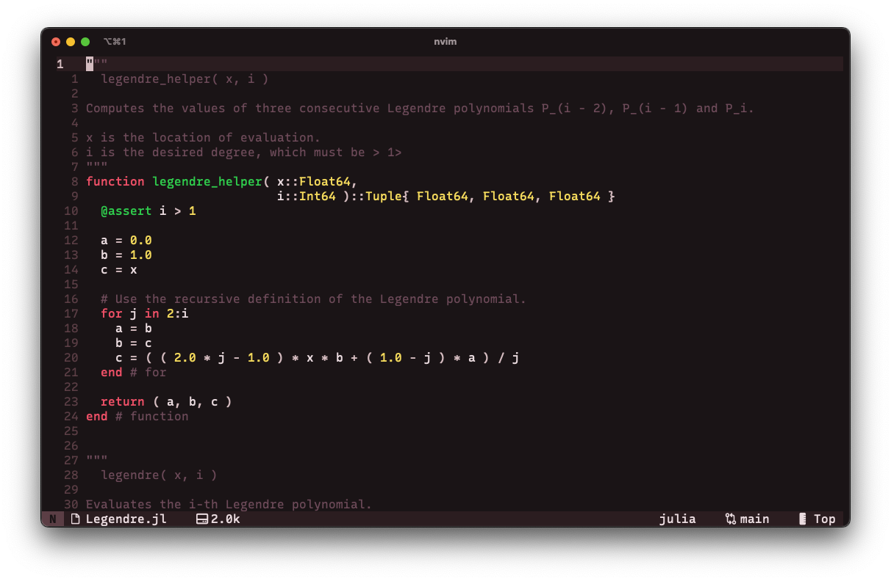
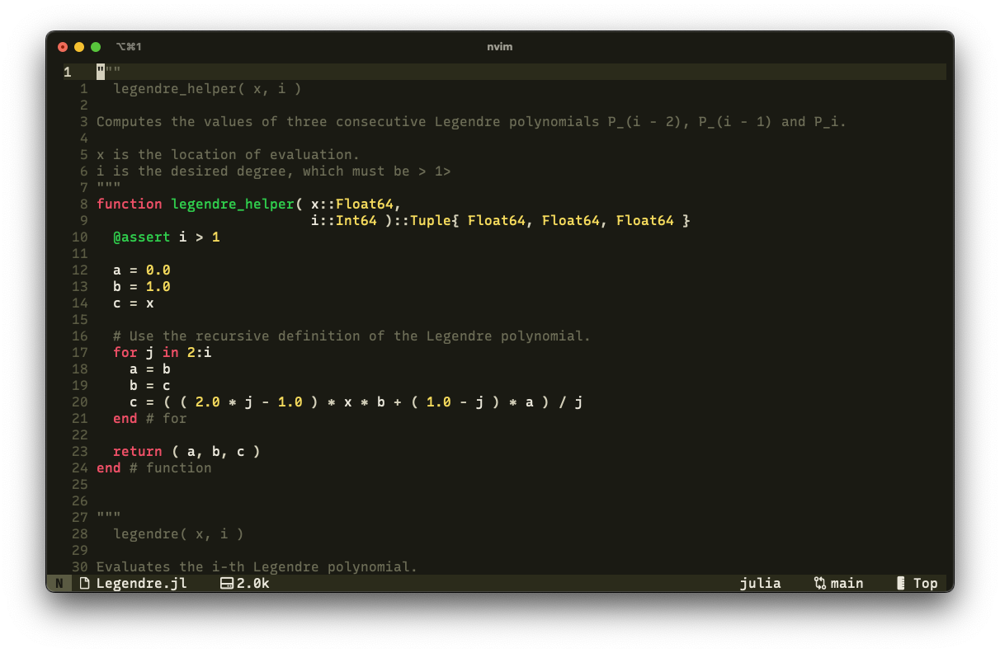
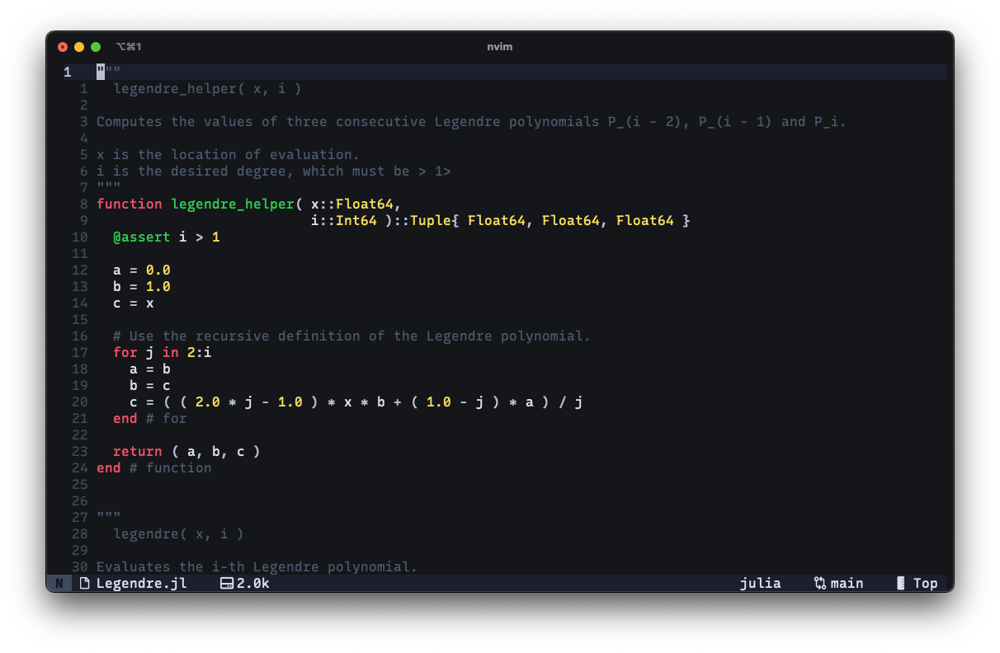
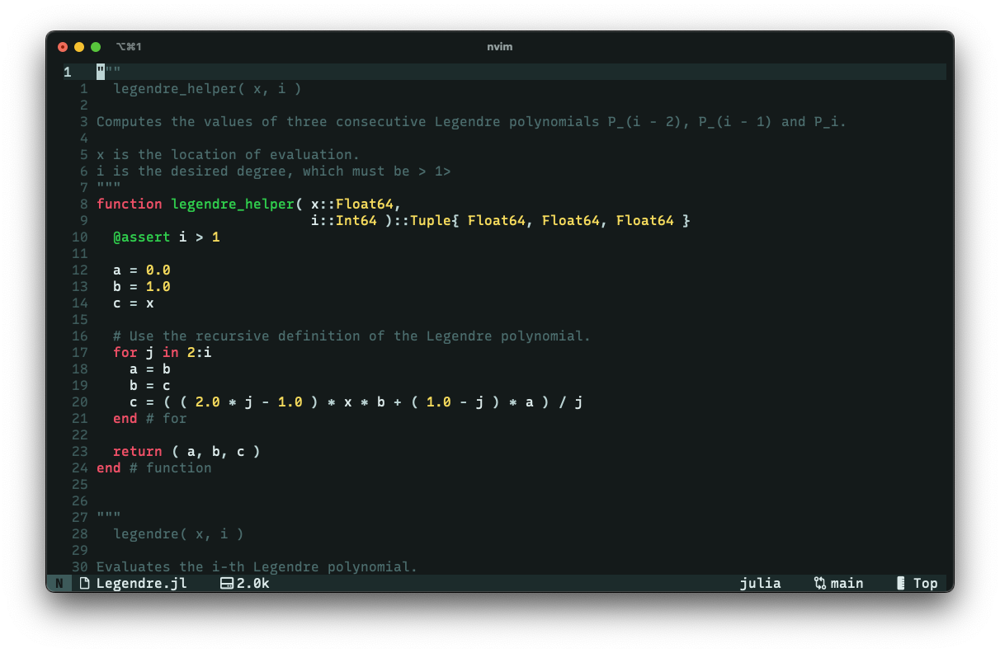

<h1 align = "center">🏜 velura.nvim</h1>

**velura.nvim** is a dark [Neovim](https://neovim.io/) color scheme written in Lua, featuring customizable tints and bold accents. This theme provides a consistent look with high contrast for good readability.

<table>
    <tr>
        <td><p align = "center">Red</p></td>
        <td><p align = "center">Green</p></td>
    </tr>
    <tr>
        <td></td>
        <td></td>
    </tr>
    <tr>
        <td><p align = "center">Yellow</p></td>
        <td><p align = "center">Blue</p></td>
    </tr>
    <tr>
        <td></td>
        <td></td>
    </tr>
    <tr>
        <td><p align = "center">Purple</p></td>
        <td><p align = "center">Cyan</p></td>
    </tr>
    <tr>
        <td></td>
        <td></td>
    </tr>
</table>

*The font used in the screenshots is [Recursive Mono Linear](https://github.com/arrowtype/recursive).*


## 🧰 Features

- **Customizable Tints**: Easily switch between red, green, yellow, blue, purple, and cyan tinted themes to suit your liking.
- **Vivid Highlights**: Strong accent colors ensure clear visibility in various editor modes.
- **Plugin Support**: (Partial) support for popular plugins like Treesitter, Telescope, and GitSigns.


## 💿 Installation & Usage

Add the following to your `lazy.nvim` configuration:
```lua
require( "lazy" ).setup( {
    { "schmaeke/velura.nvim" },
})
```

To apply the theme use:
```lua
require( "velura" ).setup{ }
vim.cmd.colorscheme( "velura" )
```


## ⚙️ Configuration

velura.nvim allows you to customize the color tint for both background and foreground, so you can set the overall aesthetic.


### Available Options

Tint (default: "red"): Change the tint of the fore- and background. Options include:
- "red"
- "green"
- "yellow"
- "blue"
- "purple"
- "cyan"

```lua
require( "velura" ).setup( { tint = "blue" } )
```

> [!NOTE]
> The setup function call has to happen before applying the theme.


## 🧩 Plugin Support

velura.nvim provides styling for the following plugins:
- [gitsigns](https://github.com/lewis6991/gitsigns.nvim)
- [lualine](https://github.com/nvim-lualine/lualine.nvim)
- [noice](https://github.com/folke/noice.nvim)
- [notify](https://github.com/rcarriga/nvim-notify)
- [treesitter](https://github.com/nvim-treesitter/nvim-treesitter)
- [telescope](https://github.com/nvim-telescope/telescope.nvim)


### Usage with [Lualine](https://github.com/nvim-lualine/lualine.nvim)

velura.nvim includes a matching theme for lualine.nvim. 
Add this to your Lualine configuration:
```lua
require( "lualine" ).setup( {
    options = { theme = "velura" }
} )
```


## 🔌 Additional Ports

Ports of velura are located in the ports directory, with current support for:
- [iTerm2](https://github.com/gnachman/iTerm2)

*[Ghostty](https://mitchellh.com/ghostty) will be added as soon as I get access to it.*


## 🧬 Palette

The theme is based on six accent colors
<table>
    <tr>
        <td><b>Accents</b></td>
        <td>Reds</td>
        <td>Yellows</td>
        <td>Greens</td>
        <td>Cyans</td>
        <td>Blues</td>
        <td>Purples</td>
    </tr>
    <tr>
        <td>Dark</td>
        <td>#C5233F</td>
        <td>#E2BB36</td>
        <td>#29A245</td>
        <td>#58AA9A</td>
        <td>#2A8AD9</td>
        <td>#9D3BD6</td>
    </tr>
    <tr>
        <td>Base</td>
        <td>#DC2C48</td>
        <td>#E9C946</td>
        <td>#33B34E</td>
        <td>#66B8A7</td>
        <td>#3C9BE1</td>
        <td>#A948E0</td>
    </tr>
    <tr>
        <td>Bright</td>
        <td>#E94C66</td>
        <td>#F3D870</td>
        <td>#42CC60</td>
        <td>#80C9BC</td>
        <td>#5FB2F0</td>
        <td>#BB6EF1</td>
    </tr>
    <tr>
        <td>Pastel</td>
        <td>#F4A1AB</td>
        <td>#E2BB36</td>
        <td>#29A245</td>
        <td>#58AA9A</td>
        <td>#A8D1F4</td>
        <td>#E0B3E8</td>
    </tr>
</table>

For each set of accent colors there is a set of base colors

<table>
    <tr>
        <td><b>Red</b></td>
        <td>Dark</td>
        <td>Base</td>
        <td>Bright</td>
        <td>Brighter</td>
        <td>Even Brighter</td>
        <td>Very Brighter</td>
    </tr>
    <tr>
        <td>Background</td>
        <td>#1A1416</td>
        <td>#2B1D20</td>
        <td>#3A272B</td>
        <td>#483034</td>
        <td>#5A3E45</td>
        <td>#6C4A58</td>
    </tr>
    <tr>
        <td>Foreground</td>
        <td>#D4BCC0</td>
        <td>#DDC8CC</td>
        <td>#E9DBDF</td>
        <td>#F3E8EB</td>
        <td>/</td>
        <td>/</td>
    </tr>
</table>

<table>
    <tr>
        <td><b>Yellow</b></td>
        <td>Dark</td>
        <td>Base</td>
        <td>Bright</td>
        <td>Brighter</td>
        <td>Even Brighter</td>
        <td>Very Brighter</td>
    </tr>
    <tr>
        <td>Dark</td>
        <td>#1A1A14</td>
        <td>#2B2B1D</td>
        <td>#3A3A27</td>
        <td>#484834</td>
        <td>#5A5A45</td>
        <td>#6C6C58</td>
    </tr>
    <tr>
        <td>Foreground</td>
        <td>#D4D0BC</td>
        <td>#DDDBC8</td>
        <td>#E9E6DB</td>
        <td>#F3F0E8</td>
        <td>/</td>
        <td>/</td>
    </tr>
</table>

<table>
    <tr>
        <td><b>Green</b></td>
        <td>Dark</td>
        <td>Base</td>
        <td>Bright</td>
        <td>Brighter</td>
        <td>Even Brighter</td>
        <td>Very Brighter</td>
    </tr>
    <tr>
        <td>Background</td>
        <td>#141A16</td>
        <td>#1D2B20</td>
        <td>#273A2B</td>
        <td>#304834</td>
        <td>#3E5945</td>
        <td>#4C6B58</td>
    </tr>
    <tr>
        <td>Foreground</td>
        <td>#BCD4C0</td>
        <td>#C8DDCC</td>
        <td>#DBE9DF</td>
        <td>#E8F3EB</td>
        <td>/</td>
        <td>/</td>
    </tr>
</table>

<table>
    <tr>
        <td><b>Cyan</b></td>
        <td>Dark</td>
        <td>Base</td>
        <td>Bright</td>
        <td>Brighter</td>
        <td>Even Brighter</td>
        <td>Very Brighter</td>
    </tr>
    <tr>
        <td>Background</td>
        <td>#141A1A</td>
        <td>#1D2B2B</td>
        <td>#273A3A</td>
        <td>#304848</td>
        <td>#3E5A5A</td>
        <td>#4C6C6C</td>
    </tr>
    <tr>
        <td>Foreground</td>
        <td>#BCD4D4</td>
        <td>#C8DDDD</td>
        <td>#DBE9E9</td>
        <td>#E8F3F3</td>
        <td>/</td>
        <td>/</td>
    </tr>
</table>

<table>
    <tr>
        <td><b>Blue</b></td>
        <td>Dark</td>
        <td>Base</td>
        <td>Bright</td>
        <td>Brighter</td>
        <td>Even Brighter</td>
        <td>Very Brighter</td>
    </tr>
    <tr>
        <td>Background</td>
        <td>#14161A</td>
        <td>#1D202B</td>
        <td>#272B3A</td>
        <td>#303448</td>
        <td>#3E4A5A</td>
        <td>#4C5A6C</td>
    </tr>
    <tr>
        <td>Foreground</td>
        <td>#BCC0D4</td>
        <td>#C8CCDD</td>
        <td>#DBDFE9</td>
        <td>#E8EBF3</td>
        <td>/</td>
        <td>/</td>
    </tr>
</table>

<table>
    <tr>
        <td><b>Purple</b></td>
        <td>Dark</td>
        <td>Base</td>
        <td>Bright</td>
        <td>Brighter</td>
        <td>Even Brighter</td>
        <td>Very Brighter</td>
    </tr>
    <tr>
        <td>Background</td>
        <td>#1A141A</td>
        <td>#2B1D2B</td>
        <td>#3A273A</td>
        <td>#483048</td>
        <td>#5A3E5A</td>
        <td>#6C4A6C</td>
    </tr>
    <tr>
        <td>Foreground</td>
        <td>#D4BCD4</td>
        <td>#DDC8DD</td>
        <td>#E9DBE9</td>
        <td>#F3E8F3</td>
        <td>/</td>
        <td>/</td>
    </tr>
</table>


## 🔩 Contributing

Contributions, issues, and feature requests are welcome! Feel free to open an issue or submit a PR.


## 📃 License

This project is licensed under the MIT License.
