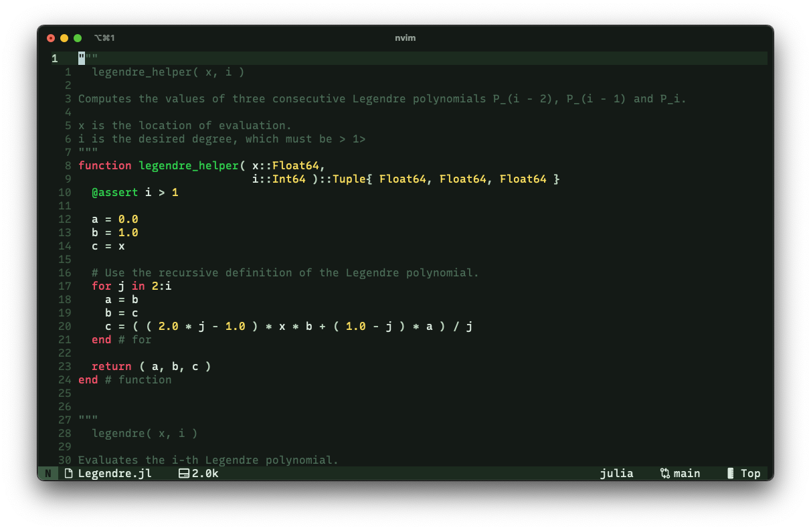

# velura.nvim

**velura.nvim** is a dark [Neovim](https://neovim.io/) color scheme written in Lua, featuring customizable tints and bold accents. This theme provides a consistent look with high contrast for good readability.


## Features

- **Customizable Tints**: Easily switch between red, green, yellow, blue, purple, and cyan tinted themes to suit your liking.
- **Vivid Highlights**: Strong accent colors ensure clear visibility in various editor modes.
- **Plugin Support**: (Partial) support for popular plugins like Treesitter, Telescope, and GitSigns.


## Palette

velura.nvim is built around six constant accent colors, each with corresponding fore- and background colors:
<p align = "center">
    
</p>
Each accent color has a corresponding set of fore- and background colors:
<p align = "center">
    
</p>

## Installation

### Using [lazy.nvim](https://github.com/folke/lazy.nvim)

Add the following to your `lazy.nvim` configuration:
```lua
require( "lazy" ).setup( {
    { "schmaeke/velura.nvim" },
})
```
To apply the theme use:
```lua
require( "velura" ).setup{ tint = "red" }
vim.cmd.colorscheme( "velura" )
```


## Configuration

velura.nvim allows you to customize the color tint for both background and foreground, so you can set the overall aesthetic.


### Available Options

- Tint (default: "red"): Change the tint of the fore- and background. Options include:
    - "red"
    - "green"
    - "yellow"
    - "blue"
    - "purple"
    - "cyan"

```lua
require( "velura" ).setup( { } )
```


## Usage with [Lualine](https://github.com/nvim-lualine/lualine.nvim)

velura.nvim includes a matching theme for lualine.nvim. 
Add this to your Lualine configuration:
```lua
require( "lualine" ).setup( {
    options = { theme = "velura" }
} )
```


## Plugin Support

velura.nvim provides styling for the following plugins:
- [gitsigns](https://github.com/lewis6991/gitsigns.nvim)
- [lualine](https://github.com/nvim-lualine/lualine.nvim)
- [noice](https://github.com/folke/noice.nvim)
- [notify](https://github.com/rcarriga/nvim-notify)
- [treesitter](https://github.com/nvim-treesitter/nvim-treesitter)
- [telescope](https://github.com/nvim-telescope/telescope.nvim)


## Screenshots

Here are a few sample screenshots of the different tints available:
<table>
    <tr>
        <td><p align = "center">red</p></td>
        <td><p align = "center">green</p></td>
    </tr>
    <tr>
        <td></td>
        <td></td>
    </tr>
    <tr>
        <td><p align = "center">yellow</p></td>
        <td><p align = "center">blue</p></td>
    </tr>
    <tr>
        <td></td>
        <td></td>
    </tr>
    <tr>
        <td><p align = "center">purple</p></td>
        <td><p align = "center">cyan</p></td>
    </tr>
    <tr>
        <td></td>
        <td></td>
    </tr>
</table>

*The font used in the screenshots is [Recursive Mono Linear](https://github.com/arrowtype/recursive).*


## Ports

Ports of velura.nvim are located in the ports directory, with current support for:
- [iTerm2](https://github.com/gnachman/iTerm2)

*[Ghostty](https://mitchellh.com/ghostty) will be added as soon as I get access to it.*


## Contributing

Contributions, issues, and feature requests are welcome! Feel free to open an issue or submit a PR.


## License

This project is licensed under the MIT License.
